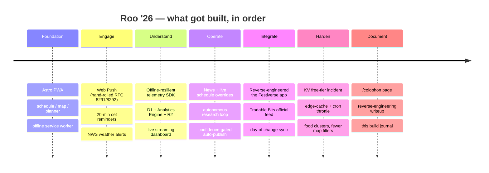
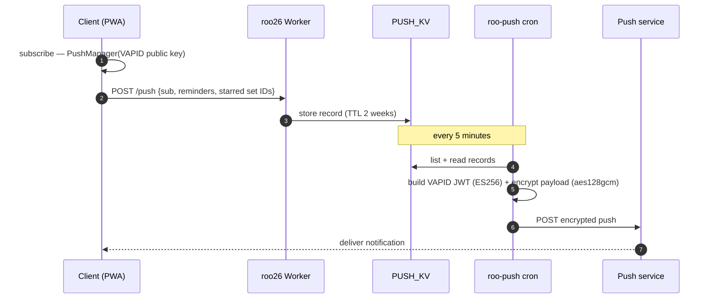
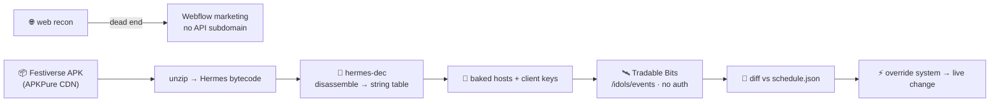

# Roo '26 — how it was built (project overview & build journal)

Source notes for a writeup of the whole project: what Roo '26 is, the engineering
worth talking about, the decisions, and the dead ends. Tight on prose, heavy on the
parts that are actually interesting. Companion to the live [`/colophon`](../src-roo26/pages/colophon.astro)
architecture page and the per-topic docs linked at the bottom.

## The premise
**Roo '26** (`roo26.alkem.dev`) is a standalone PWA for Bonnaroo 2026: full schedule +
personal planner, interactive map, live weather, closed-app push, a live news/alerts
pipeline fed by autonomous research, passive trip tracking, anonymous analytics, offline
support — and an official-schedule sync that was *reverse-engineered from the festival's
own app*. Constraints that shaped everything:

- **Edge-only.** No origin server. One Astro project → static PWA + one Cloudflare Worker.
- **No client framework.** All app logic is one vanilla-JS bundle. Festival phones on bad
  signal want instant + offline, not hydration.
- **Ship to `main`.** Small commits straight to main; Workers Builds deploys. No branches.
- **Free tier.** Stay inside Cloudflare's free limits — and when we didn't, fix it
  architecturally, not with a credit card.

| | |
|---|---|
| Origin servers | **0** |
| Edge Workers | **2** (app + cron) |
| App routes | **4** + an `/roo26-api/*` route handler |
| Sets tracked | **154** across 14 stages |
| Client framework | **none** |
| Push library | **none** (hand-rolled crypto) |

## Build arc

## The interesting parts

### 1 · No framework, edge-only
One Astro build emits the static PWA *and* a Worker (`@astrojs/cloudflare`). The Worker is
both the web server (Static Assets) and the API (`/roo26-api/*`: telemetry, news, push,
stats, crew). Four routes (`/`, `/map`, `/plan`, `/info`) are thin wrappers around a single
`_App.astro` (markup + CSS) + `_app.js` (~3k lines, all logic) + `_data/*.json`. State lives
in `localStorage`; the router is a tab-switch. A service worker pre-caches the shell + the
official festival maps so it opens with no signal.

### 2 · Web Push, crypto by hand
No `web-push` library — the full standard, written on Web Crypto: **VAPID** JWT signing
(ES256, RFC 8292) and **aes128gcm** payload encryption (ECDH P-256 → HKDF → AES-GCM,
RFC 8291). It runs in two places: instant pushes from the app Worker (news/alerts) and the
`roo-push` cron. Reverse-engineering the spec into ~60 lines of Web Crypto was the fiddliest
bit; the handshake:

### 3 · Telemetry that survives a dead zone → a live dashboard
An anonymous SDK queues events in `localStorage` and flushes via `sendBeacon`/`fetch(keepalive)`
on interval + unload + reconnect — so a tap in a no-signal field lands later. The ingestion
route fans out to **Analytics Engine** (live aggregates, 90-day), **D1** (durable log + a
per-device plan snapshot), and **R2** (optional NDJSON archive), enriched server-side from
`request.cf` (country/city/colo/device) + a salted IP hash. D1 + Analytics Engine were
**provisioned over the Cloudflare API** mid-session (the env has no `wrangler login`), and a
password-gated dashboard at `/roo26-api/stats` streams a real-time event feed, KPIs, recent
users, and historical charts. Full schema + a query cookbook: [`TELEMETRY.md`](../TELEMETRY.md).

### 4 · Live schedule changes as *data*, not a redeploy
A news item can carry a structured **schedule change** (`time`/`stage`/`cancel`/`add`). The
client overlays it onto the schedule live — a ⚡ badge, re-synced reminders, a targeted push
— while canonical `schedule.json` is never rewritten. Publishing hits a KV doc and purges an
edge cache; the change is live in seconds with no build. This is what let *Wolfmother →
Claire Rosinkranz* land instantly when it happened on-site.

### 5 · An autonomous research loop
The news pipeline can run unattended: research agents cross-reference ≥2 sources, score
confidence against a rubric, and **auto-publish high-confidence changes** (official source or
≥2 agreeing outlets) with a targeted push — gated by link-checking + dedupe. It runs as a
Claude Code **Routine** (cloud-scheduled, survives an offline laptop). Playbook: [`NEWS.md`](../NEWS.md).

### 6 · Reverse-engineering the festival's own app
The official **Festiverse** app has no public API. Web recon dead-ended (Webflow marketing,
no API subdomain), so the answer came from the **published APK**: an Expo/React Native app
whose **Hermes bytecode** was disassembled (`hermes-dec`) to recover the baked config — the
set-times come from **Tradable Bits**, fetchable with a public client key and no user auth.
We diff it against our schedule and auto-apply day-of changes. Full method, ethics, and the
stage map: [`docs/festiverse-api-reverse-engineering.md`](festiverse-api-reverse-engineering.md).

### 7 · The free-tier incident (and the fix)
A Cloudflare email: "50% of the daily KV ops." Two causes — `/news` read KV on **every**
client poll (scaled with audience), and the `roo-push` cron ran **every minute** (~1,440 KV
`list` ops/day, over the free 1,000/day cap). The fix was architectural: **edge-cache** the
news feed (60s, purged on publish) and drop the cron to **every 5 min** (288 lists/day). No
upgrade. A good reminder that "free tier" is a real design constraint, not an afterthought.

### 8 · The satellite-imagery rabbit hole
The map's basemap is a stale mosaic, so the festival field looks empty. We actually pulled
**real recent imagery**: free **Sentinel-2** (10 m, ~5-day revisit) via the AWS Earth Search
STAC API + a titiler render showed the buildout footprint from days earlier; a **Maxar 30 cm**
sample (from their open disaster program) showed what paid resolution buys. The conclusion —
free maxes at *recent-but-coarse* or *sharp-but-stale*; "today + sub-meter" means paid
tasking — was documented as a tradeoff rather than shipped.

### 9 · Decisions & dead ends
- **Spotify warm-up playlist → removed.** Spotify Development-Mode returns **403** on all
  playlist *writes* for hobby apps, and Extended Quota is enterprise-only. No fix exists, so
  it was pulled rather than left broken.
- **Food: directory + cluster pins, never fake GPS.** Bonnaroo doesn't publish per-vendor
  coordinates, so all 71 vendors are a searchable list and the map shows honest food *cluster*
  zones (with the map's real walking directions) instead of invented pins.
- **Fewer map filters.** Merged food + drinks, cut toggles 9 → 5, made stages/landmarks/
  entrances always-on orientation layers.
- **GPS trail uploaded, with disclosure.** By request, telemetry is maximal incl. the
  movement trail; the "never uploaded" copy was dropped and a fine-print note added.

## Numbers worth quoting
- **0** origin servers; **100%** on Cloudflare's edge.
- **275** events in the official Tradable Bits feed vs **154** curated music sets (the rest
  are non-music Planet Roo programming we intentionally omit).
- Telemetry captures **~25 event types** (favorites, search incl. zero-result, filters,
  shares, plan imports → a social graph, geo trail, web vitals, errors, sessions…).
- KV `list` ops cut **1,440 → 288/day** after the fix.

## Lessons
- **Constraints are the design.** "Edge-only, no framework, free tier" produced a smaller,
  faster, more durable app than the defaults would have.
- **Data beats deploys for live ops.** An override layer + edge cache means schedule fixes
  ship in seconds during a live event, safely.
- **Reverse-engineering is OSINT + patience.** No exploits — DNS, a public APK, and a bytecode
  disassembler got the official feed.
- **Watch the meter.** Free tiers have shapes (the *list* quota bit us, not reads); fit the
  architecture to them.

## Document index
| Doc | What |
|---|---|
| [`README.md`](../README.md) | File layout, invariants, deploy |
| [`/colophon`](../src-roo26/pages/colophon.astro) | Live architecture page (rendered diagrams) |
| [`TELEMETRY.md`](../TELEMETRY.md) | Analytics pipeline, schema, query cookbook |
| [`NEWS.md`](../NEWS.md) | News/overrides + the autonomous research loop |
| [`docs/festiverse-api-reverse-engineering.md`](festiverse-api-reverse-engineering.md) | The full API teardown |
| **this file** | Project overview / build journal for the writeup |
